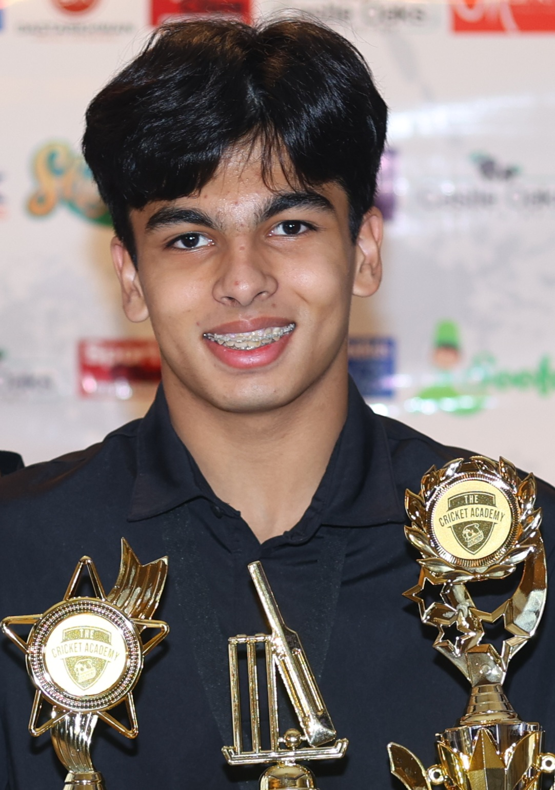

1. TOC
{:toc}

## Backgroud

    

Ever since I was young I have always been fond of tinkering and taking apart electronics. Whether it be the most basic of children's toys or more advance pieces of technology such as my dad's phone. Taking apart, fixing and putting things back together has always been my passion. This led me to the idea, what if I could make my own things from scratch. Here I am now, making my own pieces of technology, coding my own projects and sharing my journey with as many people as I can.

## Education
- Port Credit Secondary School (September 2022 - Present)

## Extracurriculars and Related Activities
- Community First Lego League Team (January 2018 - June 2021)
- Mississauga Dolphins Cricket Team (June 2023 - January 2025)
- Steam Ahead First Lego League Mentor (June 2023 - January 2024)
- PCSS Vex Robotics Team (September 2024 - Present)
- PCSS Transportation Club (September 2024 - Present)
- PCSS Cricket Club Founder and Executive (October 2024 - Present)

## Awards and Qualifications
- Mississauga Dolphins U16-U18 Most Valuable Player
- Basic First Aid and CPR
- ICC Level 1 Cricket Coach (pending)
  
## Goals & Future Projects
- Make a custom handheld game console completely from scratch ([first attempt](./handheld.html))
- Make a fully functioning BD-1 droid from Star Wars
- Get into an Electrical Engineering program
- Start my own company (Onearth); currently a work in progress

[Previous Page](./)
